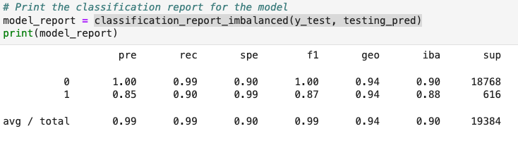
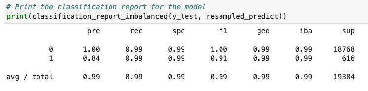

# Credit_Risk_Analysis

Credit risk analysis is a critical process for financial institutions to evaluate their lending and marketing stragegies. Credit risk poses a classification problem that’s inherently imbalanced, because healthy loans easily outnumber risky loans. In this analysis, various techniques are used to train and evaluate models with imbalanced classes. A dataset of historical lending activity from a peer-to-peer lending services company is used to build a model that can identify the creditworthiness of borrowers.

# Analysis Outline
The Analysis is split into the following sections:

1. Split the Data into Training and Testing Sets

2. Create a Logistic Regression Model with the Original Data

3. Predict a Logistic Regression Model with Resampled Training Data


# Technologies

Python implementation: CPython

Python version       : 3.7.13

IPython version      : 7.31.1

# Libraries

import numpy as np

import pandas as pd

from pathlib import Path

from sklearn.metrics import balanced_accuracy_score

from sklearn.metrics import confusion_matrix

from imblearn.metrics import classification_report_imbalanced

from sklearn.linear_model import LogisticRegression


***
## Step 1: Split the Data into Training and Testing Sets

1. Data is imported from the Resources folder under the name 'lending_data.csv' into a pandas dataframe using the read_csv function
2. Dataframe it reorgainzed to fit the parameters of the models

```
# Define our target variable (column) as y
y = df['loan_status']

# all other features (columns) are defined in X
X = df.drop(columns=['loan_status'])
```

3. The data is split into training and testing sets using the 'train_test_split' function of the sklearn library, to establish the X and y training and testing variables 
`X_train, X_test, y_train, y_test = train_test_split(X, y)`

***
## Step 2: Create a Logistic Regression Model with the Original Data
1. A logistic regression model object is created and then fit to the target and features data from the above mentioned process

logistic_regression_model = LogisticRegression(random_state=1)`

`lr_model = logistic_regression_model.fit(X_train, y_train)`

2. The same model is then used to make predictions using the X_test data

`testing_pred = lr_model.predict(X_test)`

3. The model's predictions performance is evaluated using the statistical metrics identified below.

    **Calculate the accuracy score of the model.**
    
    `balanced_accuracy_score(y_test, testing_pred)`
    
    **Generate a confusion matrix.**
    
    `confusion_matrix(y_test, testing_pred)`
    
    **Print the classification report.**



***
## Step 3: Predict a Logistic Regression Model with Resampled Training Data
1. The 'RandomOverSampler' function is used from the imbalanced-learn library to resample the data to that the class data used in the predicion made by our Logistic Regression model are equal in size

`random_oversampler = RandomOverSampler(random_state=1)`

`X_resampled, y_resampled = random_oversampler.fit_resample(X_train, y_train)`

2. The resampled data is then refit to the model for resampled predictions

```
# Instantiate the Logistic Regression model
logistic_regression_model = LogisticRegression(random_state=1)
# Fit the model using the resampled training data
resampled_lr_model = logistic_regression_model.fit(X_resampled, y_resampled)
# Make a prediction using the testing data
resampled_predict = resampled_lr_model.predict(X_test)
```

3. Finally the model's predictions from the resampled data is evaluated using the same statistical metrics used in Step 2.

    **Calculate the accuracy score of the model.**
    
    `balanced_accuracy_score(y_test, resampled_predict)`
    
    **Generate a confusion matrix.**
    
    `confusion_matrix(y_test, resampled_predict)`
    
    **Print the classification report.**



# Authors
Jodi Artman in collaboration with UC Berkeley FinTech Bootcamp

# License
per UC Berkeley standard licensing